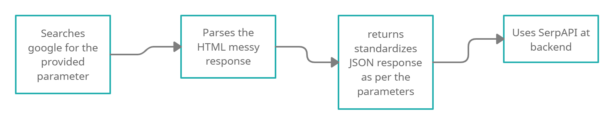
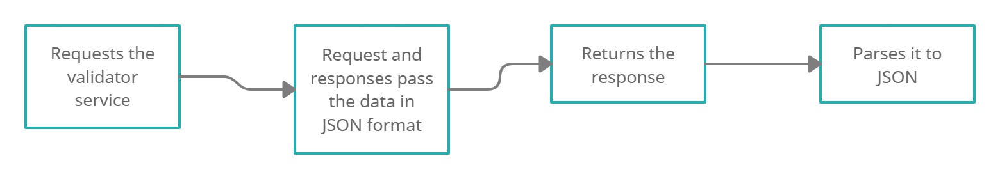
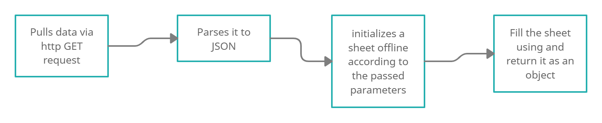
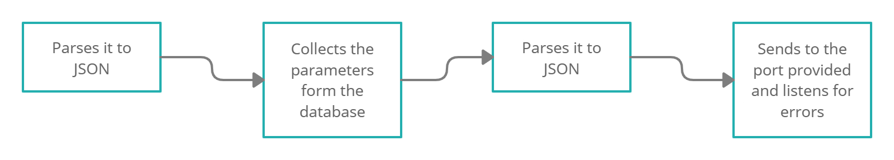

#### Made it a Public repository today.
## Note: Code is well formatted and commented at each step.

## CI

   

## slangs-api
- 
- Step 1: It searches on google using the search parameter q
- Step 2: It parses the HTML messy responses
- Step 3: It reutrns standardizes JSON response
- Step 4: It formats the request according to given parameters
- Step 5: It Executes http GET request against SerpApi(it allows to scrape the results from google search engine)
- Step 6: It parses the JSON response into a deep harsh
- Step 7: It returns the response

## validation-api(Find benchmarks [here](validation-api/benchmark.md))
- 
- Step 1: It requests the validator service
- Step 2: The requests and responses pass data in the JSON format
- Step 3: The specifications are in JSON format
- Step 4: It returns and parses the JSON formatted response
- Step 5: It returns the response in JSON format

## sheets-api(Find benchmarks [here](sheets-api/benchmark.md))
- 
- Step 1: It pulls the data via a http GET request from the desired database/website
- Step 2: It parses the output to JSON format
- Step 3: It initiallizes a sheet to store the data
- Step 4: Values are set using iterator
- Step 5: It returns the sheet object

## message-api
- 
- Step 1: It sends the message to a given socket port(may be modified later) using bufio
- Step 2: It sends the Name, Age, Gender, Hobbies
- Step 3: It listens to given socket port in case there is some message
